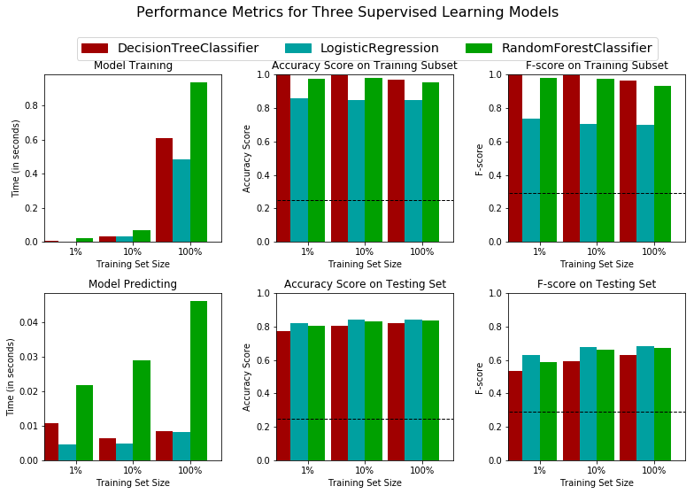

# Finding Donors for CharityML

## Table of Contents

1. [Project Motivation](#motivation)
2. [File Descriptions](#files)
3. [Results](#results)
4. [Required Libraries](#libraries)

## Project Motivation 
In this project, I applied supervised learning techniques
on data collected for the U.S. census to help CharityML (a fictitious charity organization) 
identify people most likely to donate to their cause. 

## File Descriptions 
This project contains three files:

- `finding_donors.ipynb`: This is the main file of my work on the project.
- `census.csv`: The project dataset. You'll load this data in the notebook.
- `visuals.py`: A Python file containing visualization code that is run behind-the-scenes. Do not modify

## Results 
To construct a model that accurately predicts whether an individual makes more than $50,000,
I chose three of the supervised learning models to test on the census data,
1. Decision Tree
2. Logistic Regression
3. Random Forest

As a result, I believe when 100% of the training data is used, 
`Logistic Regression model` is the most suitable for identifying individuals that make more than $50,000. 
- It has the highest test F-score with about 0.68. 
- It takes about 0.4 and 0.008 seconds in training and prediction respectively, which is a good timing compared to other models. 
- It is the best model based on the characteristics of the dataset, 
because the dataset is Multivariate, it contains both categorical and numerical variables. 
- The dependent variables are binary, it has two values =<50,000 and >50,000.

## Required Libraries 
This project requires **Python 3.x** and the following Python libraries installed:

- [NumPy](http://www.numpy.org/)
- [Pandas](http://pandas.pydata.org)
- [matplotlib](http://matplotlib.org/)
- [scikit-learn](http://scikit-learn.org/stable/)

You will also need to have software installed to run and execute an [iPython Notebook](http://ipython.org/notebook.html)

It's recommend to install [Anaconda](https://www.continuum.io/downloads),
a pre-packaged Python distribution that contains all of the necessary libraries and software for this project.
